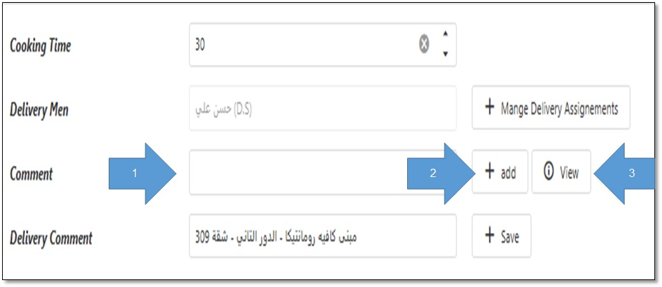

# الــكــومــنــت

الكومنت هو الحاجة اللي بتبين إذا كان اتعمل متابعة علي الطلب ولا لأ و هل كلمنا العميل وايه اللي حصل في المكالمة و ايه السبب ان الطلب متأخر و احنا عملنا ايه عشان الطلب متأخر.
 بإختصار ده الأمان بتاع الموظف.

لازم نحط كومنت بكل أكشن عملناه علي الطلب:
 كلمت المندوب.
 كلمت المطعم.
 كلمت العميل.
 العميل مردش؟
 لغيت الطلب ليه؟
 المندوب اتأخر ليه؟

<h3 align="right">إزاي نكتب كومنت علي الطلب؟</h3>

نفتح شاشة تفاصيل الطلب.
 مكان كتابة الكومنت.
 نضغط هنا عشان نضيف الكومنت.
 و نضغط هنا عشان نشوف اي كومنت مكتوب علي الطلب

<figure><figcaption></figcaption></figure>

<h2 align="center">أوعي تنسي تكتب كومنت</h2>

<figure><figcaption></figcaption></figure>
