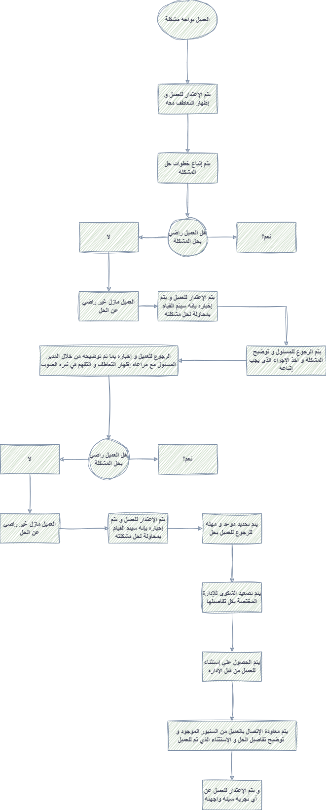

# التعامل مع شكاوي العملاء

اسمع للعميل للأخر بدون مقاطعة:
 خليه يفضفض ويشرح المشكلة بالكامل.
 ده بيخليه يحس إنك مهتم، وبيقلل من حدّة التوتر عنده.

***

إظهر تعاطف حقيقي
 جُمل بسيطة بتعمل فرق كبير جدًا:
 "أنا مقدّر جدًا الموقف اللي حضرتك فيه"
 "معاك حق تكون متضايق"
 ده مش اعتراف بالخطأ، لكنه احترام لمشاعر العميل.

***

اعتذر بشكل مهني
 "أنا بعتذر لحضرتك عن الإزعاج اللي حصل"
 الاعتذار مش ضعف، بالعكس، ده بيهدّي الموقف ويفتح باب للحل.

***

اطلب معلومات واضحة اسأل عن التفاصيل اللي هتساعدك تفهم المشكلة صح في حالة إنها مش واضحة:  رقم الطلب  وقت المشكلة  صور/إثبات لو محتاج  كل ده يقلل وقت الحل.

***

خليك هادي مهما حصل حتى لو العميل رفع صوته أو اتهم الشركة، رد بهدوء تام. الموظف لازم يكون الشخص الثابت في المكالمة.

***

قدّم حل واضح وعملي العميل عايز يعرف: إيه اللي هيتعمل؟ إمتى؟ وإزاي هيتابع؟ تجنب الكلام العام زي "هنشوف الموضوع".

***

كن صادق وشفاف لو في تأخير أو سياسة معينة، وضحها باحترام. العميل بيقدّر الوضوح حتى لو مش عاجبه القرار.

في حالة العميل مش راضي بالحل بينله إنك معاه و بتحاول تساعده زي إنك ممكن تبلغه إنك هتعمل محاولة أو هتشوف إذا كان في أي إستثناء ممكن يتقدمله و هترجعله بالرد في خلال فترة زمنية محددة و إرجع اتواصل معاه في الوقت اللي حددته و بلغه بالحل اللي اتقالك من الشخص المسئول

حتي لو لسة موصلتش لحل في الوقت ده إرجع كلمه و بلغه إنك لسة بتتابع مشكلته و منتظر الرد من الإدارة و إنك هترجع تكلمه تاني في خلال مدة محددة

و نكرر تاني نقطة الهدوء و دايما نحاول نوصل للعميل إننا متعاطفين معاه

في حالات الشكاوي الإسكريبت مش مهم بنفس أهمية الحل اللي بنقدمه للعميل

المهم إننا نسمع للعميل و نفهمه و نعتذرله و نكون دايما متعاطفين معاه و نقدمله الحل في حدود البروسيس اللي موجودة و لو العميل طالب أكتر من إمكانياتك إرجع للشيفت ليدر أو التيم ليدر خد منهم حل أو أبروف علي حل 

<figure><figcaption></figcaption></figure>

