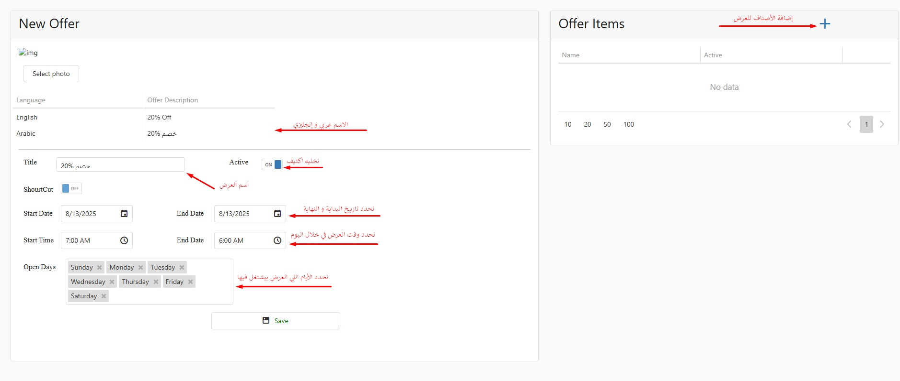

# Creating Offers

<h3 align="right">أنواع العروض علي التطبيق</h3>

<h4 align="right">عروض خصم نسبة مئوية</h4>

و فيها بيتم خصم نسبة مئوية من السعر بغض النظر السعر كام

<h4 align="right">عروض خصم مبلغ محدد</h4>

و فيها بيتم خصم مبلغ محدد من السعر كمثال خصم 50 جنيه علي اصناف محددة

<h4 align="right">عروض الباندل</h4>

و دي بيكون فيها العروض التانية زي اشتري اتنين بسعر واحدة او عروض تلاتة و واحد مجانا و هكذا

<h3 align="right">إزاي بنعمل عرض لمكان </h3>

أول حاجة بنعمل كاتيجوري جديد بإسم العرض و عشان نعمل كدة أول حاجة هندخل علي شاشة المكان الرئيسية و نضغط علي المنيو

<figure><figcaption></figcaption></figure>

كدة هندخل علي صفحة التحكم في المنيو و من هنا هنضغط علي علامة الزائد عشان نضيف كاتيجوري

<figure><figcaption></figcaption></figure>

هتفتحلنا صفحة إضافة كاتيجوري جديد و هنملي التفاصيل زي الصورة

<figure><figcaption></figcaption></figure>

بعد الحفظ نضغط باك هنرجع لصفحة المنيو و هنلاقي الكاتيجوري اتضاف في المنيو

<figure><figcaption></figcaption></figure>

بعد كدة هنروح نشوف الأيتمز اللي هنعمل عليها العرض و نعملها كوبي و كدة هيكون الصنف متكرر عندنا مرتين

<figure><figcaption>
نسخ الصنف
</figcaption></figure>

<figure><figcaption>
بعد النسخ يكون الصنف مكرر
</figcaption></figure>

بعد كدة ننقل الأصناف اللي نسخناها لكاتيجوري العروض عن طريق اننا نضغط علي تفاصيل الصنف

<figure><figcaption></figcaption></figure>

Save و من شاشة تفاصيل الصنف نختار الكاتيجوري زي ما موضح في الصورة و بعدين نضغط 

<figure><figcaption></figcaption></figure>

بعد الحفظ نضغط باك هنلاقي ان الصنف مش متكرر

مع مراعاة إننا نتأكد ان الصنف المتبقي في الكاتيجوري الأصلي مش أكتيف عشان ميحصلش عندنا تكرار في الأبليكيشن

***

بعد الخطوات دي نطلع لشاشة المطاعم و نعمل فلتر للمطعم بتاعنا و نضغط علي علامة العروض عشان نعمل عرض جديد

<figure><figcaption></figcaption></figure>

بعد كدة نضغط علي إضافة عرض

<figure><figcaption></figcaption></figure>

هندخل شاشة إضافة عرض و الأول نملي البيانات اللي علي الشمال الأول و بعدين نضيف الأصناف اللي هتكون في العرض زي الصورة

<figure><figcaption></figcaption></figure>

بعد كدة نضغط إضافة الأصناف و نعمل الخطوات اللي في الصورة 

<figure><figcaption></figcaption></figure>

<figure><figcaption></figcaption></figure>

بعد اضافة الأصناف نرجع لشاشة إضافة عرض الرئيسية و هنضغط حفظ

<figure><figcaption></figcaption></figure>

و كدة يكون العرض إتضاف عندنا في شاشة العروض

<figure><figcaption></figcaption></figure>



يجب مراعاة



دي كانت طريقة إضافة عروض خصم النسبة و المبلغ 

عند كتابة قيمة الخصم في عرض النسبة المئوية لا يتم كتابة علامة %

***

<h3 align="right">إضافة عرض باندل</h3>

عشان نضيف عرض باندل أول جاجة نعمل كاتيجوري للعرض نفس الخطوات السابقة

<figure><figcaption></figcaption></figure>

بعد كدة ندخل علي تفاصيل الكاتيجوري 

<figure><figcaption></figcaption></figure>

بنعمل صنف من داخل الكاتيجوري باسم العرض اول جاجة نضغط علي إضافة صنف

<figure><figcaption></figcaption></figure>

هندخل علي شاشة إضافة صنف و نملي البيانات زي الصورة

<figure><figcaption></figcaption></figure>

بعد ما نضغط حفظ هننتقل لصفحة الحجم و السعر نملي البيانات اللي فيها و نضغط حفظ

<figure><figcaption></figcaption></figure>

بعد عمل الصنف باسم العرض يتم نسخ الأصناف اللتي يشملها العرض و إضافتها في كاتيجوري الأوبشنز و تفعيلها كأوبشنز في العرض

لمعرفة كيفية إضافة اوبشنز لصنف برجاء مراجعة  <a data-mention href="adding-options.md">adding-options.md</a>

