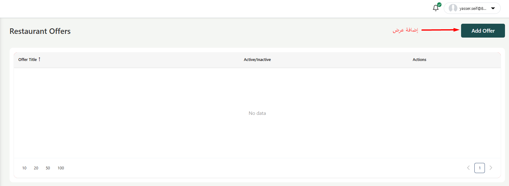

# Creating Offers

<h3 align="right">أنواع العروض علي التطبيق</h3>

<h4 align="right">عروض خصم نسبة مئوية</h4>

و فيها بيتم خصم نسبة مئوية من السعر بغض النظر السعر كام

<h4 align="right">عروض خصم مبلغ محدد</h4>

و فيها بيتم خصم مبلغ محدد من السعر كمثال خصم 50 جنيه علي اصناف محددة

<h4 align="right">عروض الباندل</h4>

و دي بيكون فيها العروض التانية زي اشتري اتنين بسعر واحدة او عروض تلاتة و واحد مجانا و هكذا

<h3 align="right">إزاي بنعمل عرض لمكان </h3>

من شاشة المطاعم نعمل فلتر للمطعم بتاعنا و نضغط علي علامة العروض عشان نعمل عرض جديد

<figure><figcaption></figcaption></figure>

بعد كدة نضغط علي إضافة عرض

<figure><figcaption></figcaption></figure>

هندخل شاشة إضافة عرض و الأول نملي البيانات اللي علي الشمال الأول و بعدين نضيف الأصناف اللي هتكون في العرض زي الصورة

<figure><figcaption></figcaption></figure>

بعد كدة نضيف صورة العرض و بعدين نضغط إضافة الأصناف و نعمل الخطوات اللي في الصورة مع مراعاة التالي في حالة إن العرض نسبة يمكن أختيار كل الأصناف مرة واحدة في حالة أن العرض خصم مبلغ يتم اختيار أيتم واحد فقط كل مرة 

<figure><figcaption></figcaption></figure>

بعد اضافة الأصناف نرجع لشاشة إضافة عرض الرئيسية و هنضغط حفظ

<figure><figcaption></figcaption></figure>

و كدة يكون العرض إتضاف عندنا في شاشة العروض

<figure><figcaption></figcaption></figure>



يجب مراعاة



دي كانت طريقة إضافة عروض خصم النسبة و المبلغ 

عند كتابة قيمة الخصم في عرض النسبة المئوية لا يتم كتابة علامة %

في حالة عروض الباندل يتم عمل صنف باسم العرض و عمل أوبشنز بالأصناف الموجودة في العرض

لمعرفة كيفية إضافة اوبشنز لصنف برجاء مراجعة  <a data-mention href="adding-options.md">adding-options.md</a>

