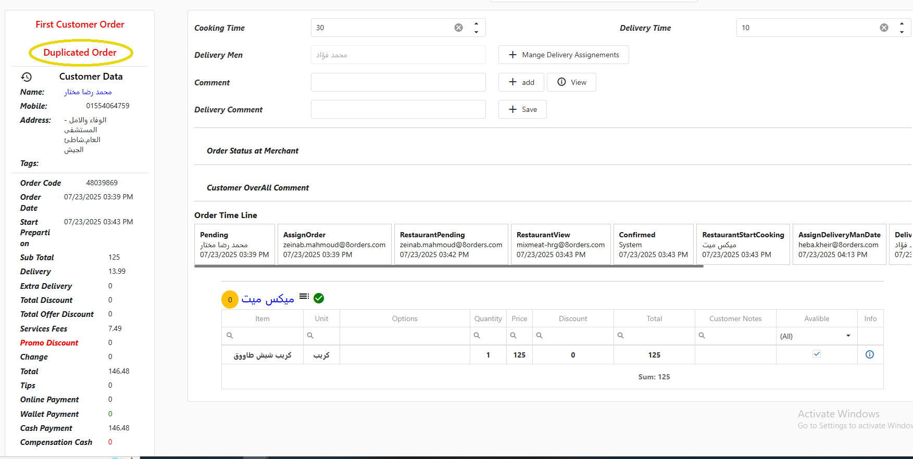

# Duplicate Order - طلب مكرر

في حالة طلب العميل لأكتر من طلب في نفس الوقت يظهر العبارة الموضحة في شاشة تفاصيل الطلب داخل الدائرة الصفراء

<figure><figcaption></figcaption></figure>

Pending في حالة إنه من نفس المكان الطلب بيقف في خانة

و يتم التواصل مع العميل و التأكيد علي صحة الطلب

لو الطلب صحيح بيتم تأكيد الطلب

Duplicate Order لو الطلب خطأ بيتم إلغاء الطلب و بيكون سبب الإلغاء 

pending أما في حالة انه مش من نفس المكان فلا يقف الطلب في مرحلة 

و لكن في حالة ملاحظة الطلب يتم إتباع باقي الخطوات

