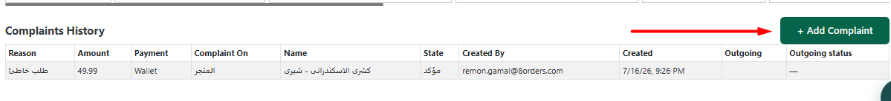

# 🚴‍♂️ عمل توصيلة إضافية

<h3 align="center">امتي بعمل توصيلة إضافية؟</h3>

في أوقات كتير بنحتاج نعمل توصيلة إضافية كمثال:

الطلب وصل ناقص للعميل و العميل حابب يوصله الصنف الناقص.

الطلب وصل غلط للعميل و العميل حابب يوصله الطلب الصح.

الطلب كبير و محتاج اكتر من مندوب لتوصيله.

<h3 align="center">ازاي بعمل توصيلة إضافية؟</h3>

 Add Complaint من جوة شاشة الطلب و في كل المراحل نقدر نضغط علي 

<figure><figcaption></figcaption></figure>

نمشي خطوات تسجيل الشكوي عادي لغاية الوصول لمرحلة توصيلة إضافية

 

يتم إختيار إنشاء توصيلة 

<figure><figcaption></figcaption></figure>

بعدين هتظهرلنا الشاشة دي نختار اسم المتجر و نكتب الكومنت المطلوب 

<figure><figcaption></figcaption></figure>

<h3 align="center">مع ملاحظة ان التوصيلة يتم تحميلها تلقائي علي الطرف اللي اخترناه عند تسجيل الكومبلين</h3>

<h3 align="center">كدة تكون عملت أول توصيلة خارجية ليك</h3>

<figure><figcaption></figcaption></figure>
