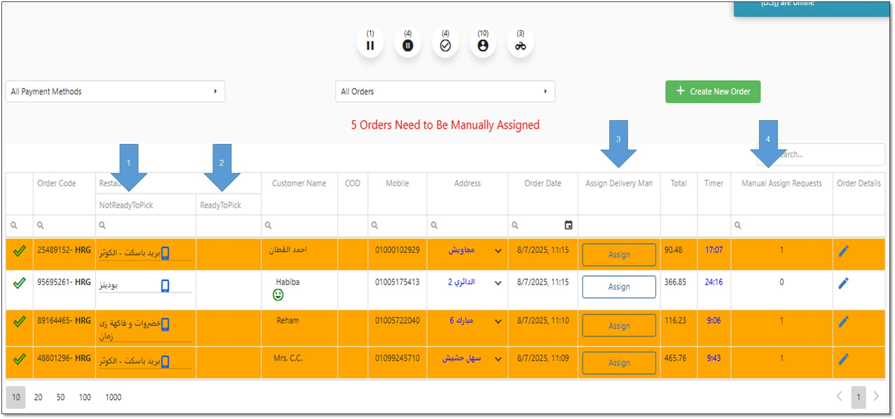

# شاشة الطلبات – مرحلة Confirm

في هذه المرحلة تظهر الطلبات بعد تأكيد الطلب من المتجر.
 الحقول المختلفة في هذه الشاشة:
 1-NotReadyToPick في حالة عدم الإنتهاء من تجهيز الطلب يظهر اسم المتجر في خانة .
 2- ReadyToPick في حالة الإنتهاء من تجهيز الطلب يظهر اسم المتجر في خانة .
 3-Assign لتعيين مندوب يدويا علي الطلب يتم الضغط علي .
 4-Manual Assign Request عند الحاجة لتعيين مندوب يدويا يظهر رقم 1 في خانة

<figure><figcaption></figcaption></figure>
