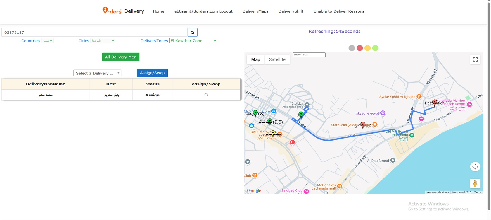

# تعيين مندوب

هذه الشاشة تفتح عند التعيين اليدوي للمندوب أو تغيير المندوب من أي شاشة من شاشات النظام

يتم تعيين مندوب في حالة عدم قبول أي مندوب للطلب في التعيين التلقائي من النظام

عند تعيين مندوب يراعي ان يكون قريب من موقع المتجر

#### علي الخريطة

Online &#x26; Free العلامة الخضراء تعني المناديب العاملين و ليس معهم طلب 

Busy العلامة الصفراء تعني المناديب العاملين و معهم طلب 

Offline العلامة الحمراء تعني المناديب الغير عاملين 

الخط الأزرق هو مسار المندوب من المتجر للعميل حيث



هي موقع المتجر Origin





هي موقع العميل Destination





يتم تحديث مواقع المناديب كل 30 ثانية



<figure><figcaption></figcaption></figure>

1- في حالة وجود مندوب بالفعل علي الطلب يظر اسمه هنا.
 2- اسم المتجر.
 3- حالة الطلب.
 4- اختيار المندوب للطلب.
 5- إظهار أسماء كل المناديب في الجدول.
 6- البحث باسم المندوب.
 7- تأكيد إختيار المندوب للطلب.

<figure><figcaption></figcaption></figure>
