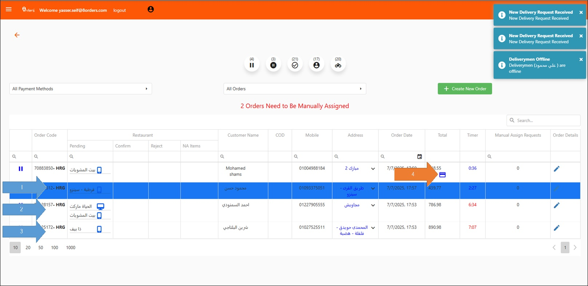
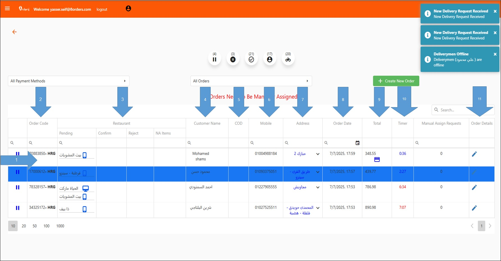

# شاشة الطلبات – مرحلة Pending

في هذه المرحلة تظهر الطلبات قبل ظهورها للمتاجر.
 الطلبات التي يجب أخذ إجراء عليها في هذه المرحلة هي:

1- عميل يطلب لأول مرة (تظهر باللون الأزرق)
 2- أوردر مجمع من أكثر من مكان.
 3- أوردر كبير بمبلغ اكبر من 1000 جنيه
 4- أوردر مدفوع أونلاين حتي يتم تأكيد الدفع (تظهر العلامة الموضحة)

<figure><figcaption></figcaption></figure>

1- كل طلب يظهر في صف.
 2- رقم الطلب.
 3- المتجر يظهر اسم المتجر في خانة حالة الطلب الحالية.
 4- اسم العميل.
 5- حالة الدفع عند الإستلام.
 6- رقم تليفون العميل.
 7- عنوان العميل.
 8- تاريخ الطلب.
 9- إجمالي سعر الطلب.
 10- المدة التي امضاها الطلب في المرحلة.
 11- تفاصيل الطلب: لإظهار تفاصيل الطلب يتم الضغط علي علامة القلم.


في حالة ان الطلب في المدة الطبيعية يكون لون العداد أزرق أما في حالة التأخير يكون أحمر.


<figure><figcaption></figcaption></figure>
