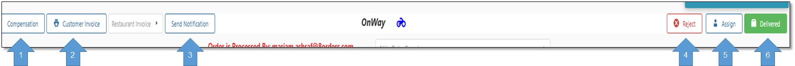

# قسم الإجراءات

1- تعويض العميل.
 2- إظهار أيصال جاهز للطباعة لإرساله للعميل.
 3- إرسال إشعار عن طريق التطبيق للعميل.
 4- إلغاء الطلب.
 5- تعيين مندوب او تغيير المندوب.
 6- تغيير حالة الطلب سواء Delivered او OnWay علي حسب مرحلة الطلب و بناء علي طلب المندوب.

<figure><figcaption></figcaption></figure>
