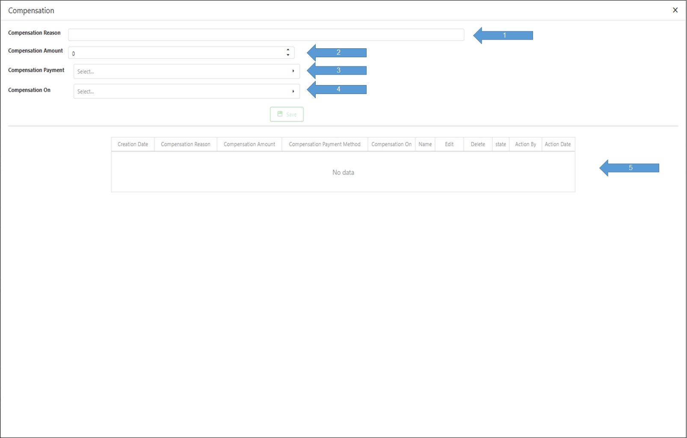

# التعويض

1- يتم كتابة سبب التعويض.
 2- يتم كتابة مبلغ التعويض.
 3- يتم اختيار طريقة التعويض سواء:
 4- كاش : في حالة أن الطلب مازال فعال و يكون عن طريق خصم مبلغ من قيمة الطلب.
 a- محفظة أو Wallet: و يكون بعد إنتهاء الطلب و يتم إداع المبلغ في محفظة العميل علي التطبيق.
 b- تحميل التعويض و يتم اختيار الجهة التي سيتم تحميل التعويض عليها سواء المندوب أو التاجر أو الشركة أو قسم العمليات 4- بناء علي المتسبب في المشكلة.
 5- تفاصيل التعويض الموجود علي الطلب إن وجد.

<figure><figcaption></figcaption></figure>
