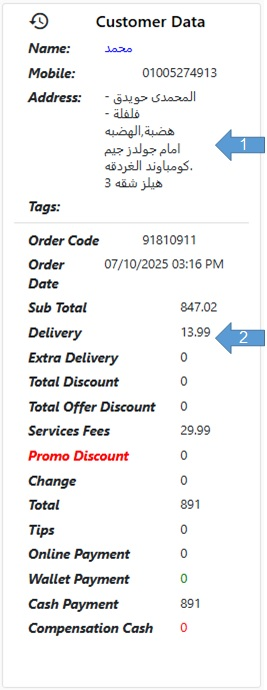

# قسم فاتورة الطلب

بيانات العميل:
 - الاسم.
 - رقم المحمول.
 - العنوان.
 - الوسم أو Tag و هو اي وصف للعميل يراه الفريق سواء لتنبيه الموظفين أو المتاجر أو المندوبين.
 بيانات الطلب:
 - رقم الطلب أو Order Code.
 - تاريخ الطلب أو Order Date.
 - بداية التحضير أو Start Preparation.
 - اجمالي اسعار الأصناف أو Sub Total .
 - مصاريف التوصيل أو Delivery.
 - مصاريف توصيل إضافية أو Extra Delivery.
 - إجمالي الخصم أو Total Discount.
 - إجمالي خصم العروض أو Total Offer Discount.
 - مصاريف الخدمة أو Service Fees.
 - كود الخصم أو Promo Discount.
 - الباقي أو Change.
 - أجمالي الطلب (اسعار الأصناف + مصاريف التوصيل + مصاريف الخدمة) أو Total.
 - البقشيش أو Tips.
 - المدفوع أونلاين أو Online Payment.
 - المدفوع من المحفظة أو Wallet Payment.
 - النقدية المطلوبة أو Cash Payment.
 - التعويض النقدي إن وجد أو Compensation Cash.

<figure><figcaption></figcaption></figure>
