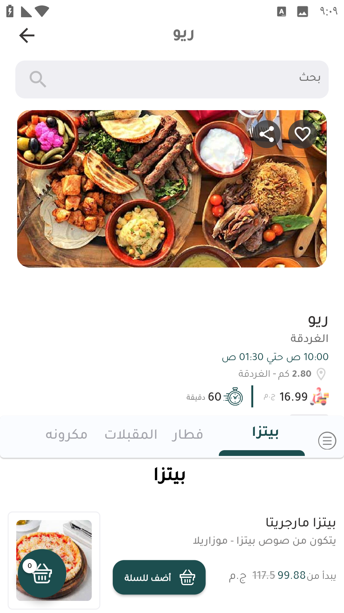
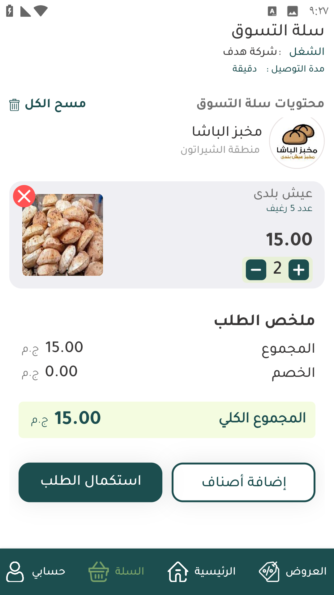
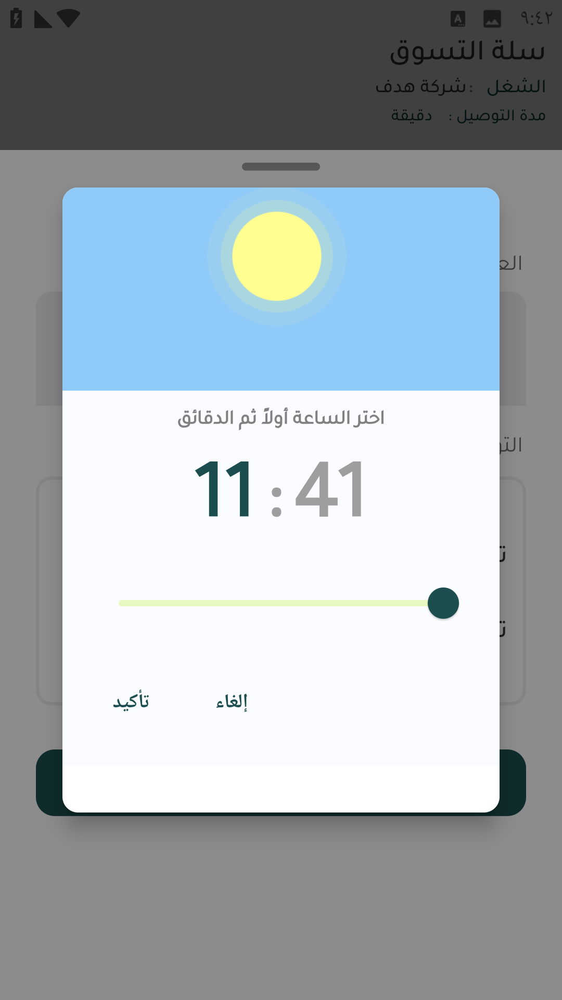
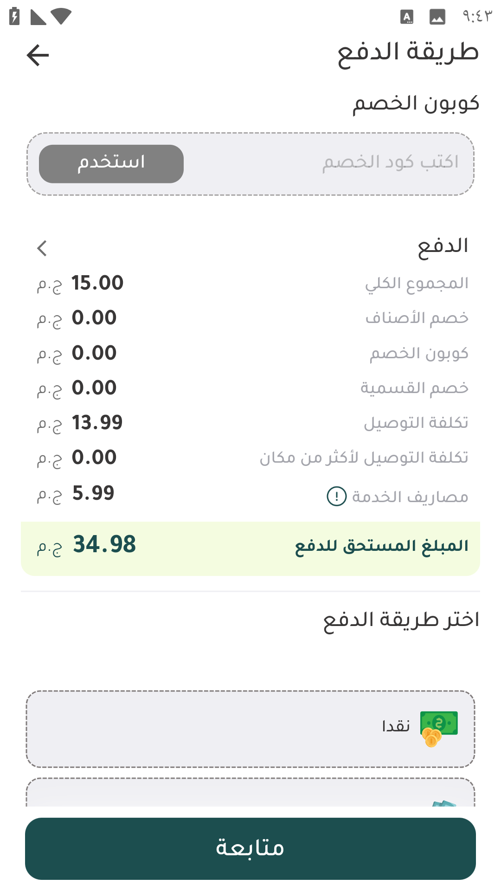
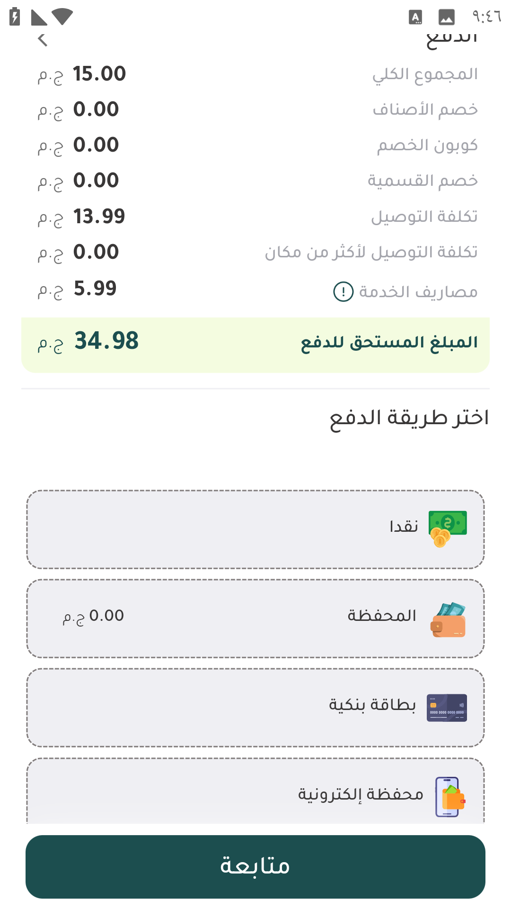
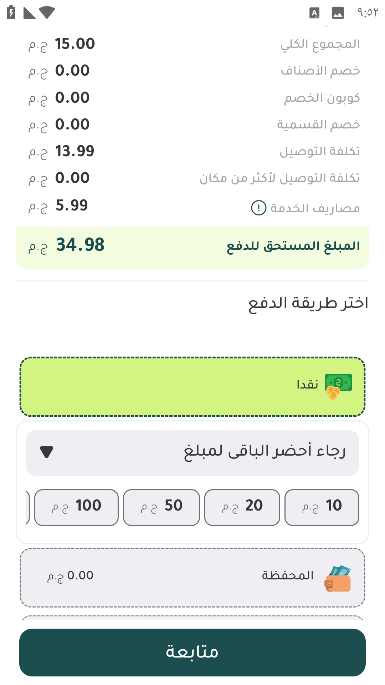
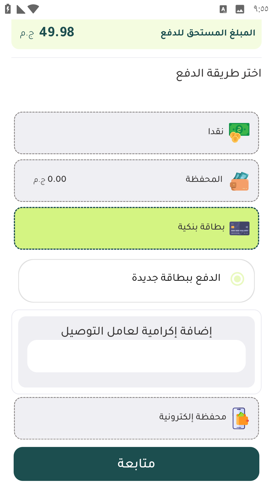
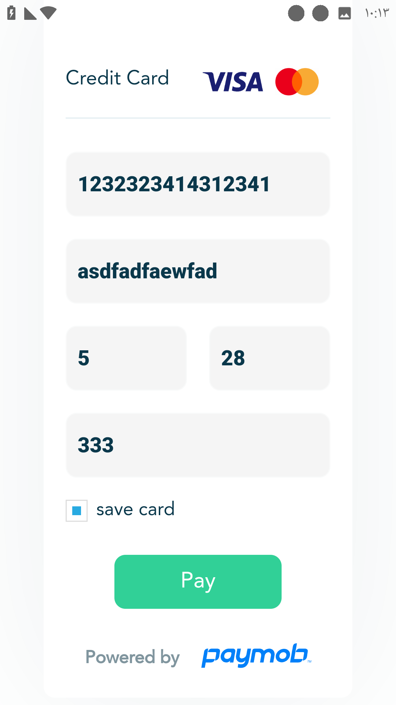
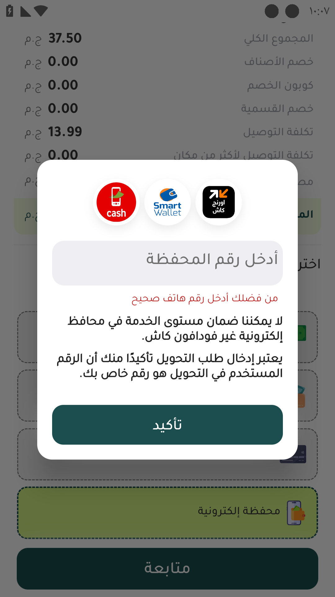
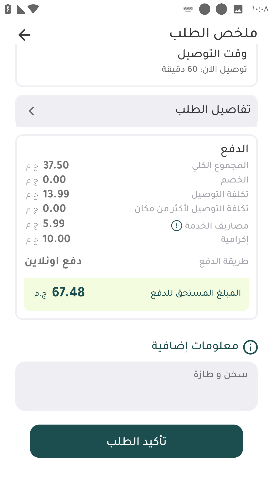

# 📲 عمل طلب

لعمل طلب يدخل العميل علي المتجر أو المطعم لأختيار الأصناف

<figure><figcaption>
المتجر
</figcaption></figure>

تحتوي شاشة المتجر الرئيسية علي 

معلومات المتجر)المدينة - مواعيد العمل - المسافة بين العنوان و المتجر - مصاريف التوصيل - مدة التوصيل(

شريط التصنيفات او اقسام المنيو

الأصناف مقسمة حسب المنيو

أيقونة السلة و عليها عدد القطع التي تم اختيارها

لإضافة صنف إلي السلة يتم الضغط علي أضف للسلة

لفتح السلة يتم الضغط علي أيقونة السلة

<figure><figcaption>
سلة التسوق
</figcaption></figure>

في سلة التسوق يمكن للعميل 

مسح كل محتويات السلة بالضغط علي مسح الكل

مسح صنف من السلة بالضغط علي علامة الإكس الحمراء

زيادة أو تقليل عدد الوحدات بالضغط علي زائد للزيادة و ناقص للتقليل

رؤية ملخص الطلب و إجمالي السعر

عند الضغط علي إضافة أصناف يتم توجيه العميل لأخر متجر إختار منه أصناف

لمتابعة الطلب يتم الضغط علي استكمال الطلب

<figure><figcaption>
تأكيد عنوان التوصيل
</figcaption></figure>

بعد الضغط علي استكمال الطلب يتم توجيه العميل لشاشة تأكيد العنوان

يتم التأكد فيها من العنوان الذي سيتم التوصيل له

و يتم اختيار وقت التوصيل 

توصيل الأن لعمل طلب فوري

توصيل لاحق لعمل فيوتشر اوردر

عند الضغط علي توصيل لاحق يتم توجيه العميل لأختيار موعد استلام الطلب

<figure><figcaption></figcaption></figure>

بعد ذلك يتم توجيه العميل لأختيار طريقة الدفع

<figure><figcaption>
1
</figcaption></figure> <figure><figcaption>
2
</figcaption></figure>

يمكن للعميل إدخال كود خصم و الضغط علي استخدام للإستفادة بأكواد الخصم

يتم ظهور تفاصيل حساب الطلب

و يتم اختير طريقة الدفع

نقدا و يمكن ان يحدد العميل المبلغ الذي يحتاج باقي له بالضغط علي الفئة النقدية

<figure><figcaption>
الباقي
</figcaption></figure>

أختيار المحفظة للإستفادة من المبلغ المتواجد في محفظة العميل علي التطبيق

الدفع بإختيار بطاقة بنكية

<figure><figcaption>
الدفع ببطاقة بنكية
</figcaption></figure>

يمكن اختيار بطاقة مسجلة أو بطاقة جديدة

يمكن تحديد بلغ إكرامية للمندوب - تبس -

يتم إدخال بيانات البطاقة بعد تأكيد الطلب

<figure><figcaption>
تفاصيل الكارت
</figcaption></figure>

<figure><figcaption>
محفظة إلكترونية
</figcaption></figure>

عند الدفع بمحفظة إلكترونية يتم طب رقم المحفظة عند الضغط علي متابعة

<figure><figcaption></figcaption></figure>

عند عمل متابعة تظهر تفاصيل الطلب و يمكن أن يضيف العميل تعليقه علي الطلب في خانة معلومات إضافية و يضغط علي متابعة الطلب و بكدة يكون عمل الطلب مظبوط

