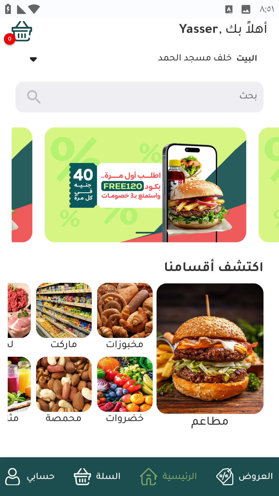
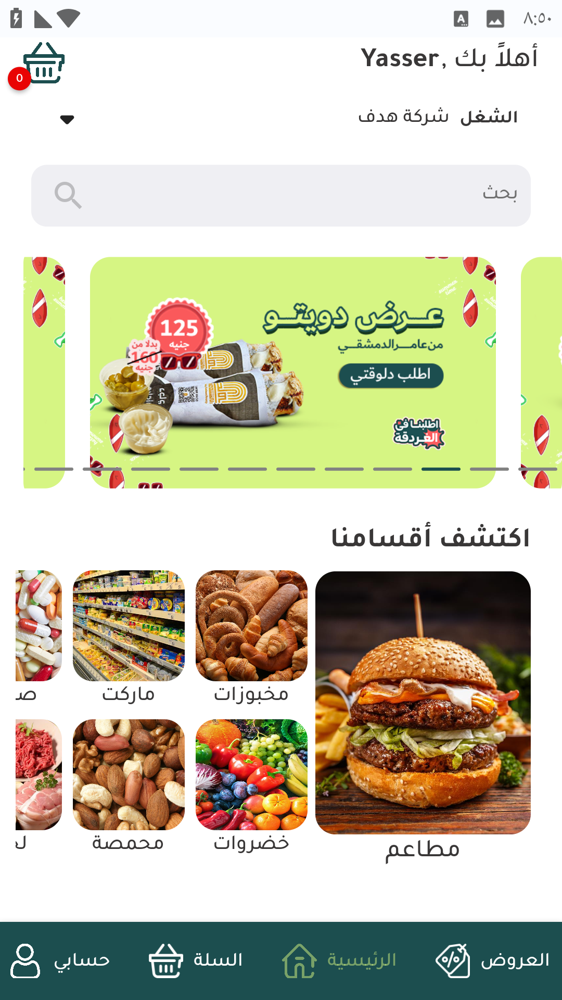
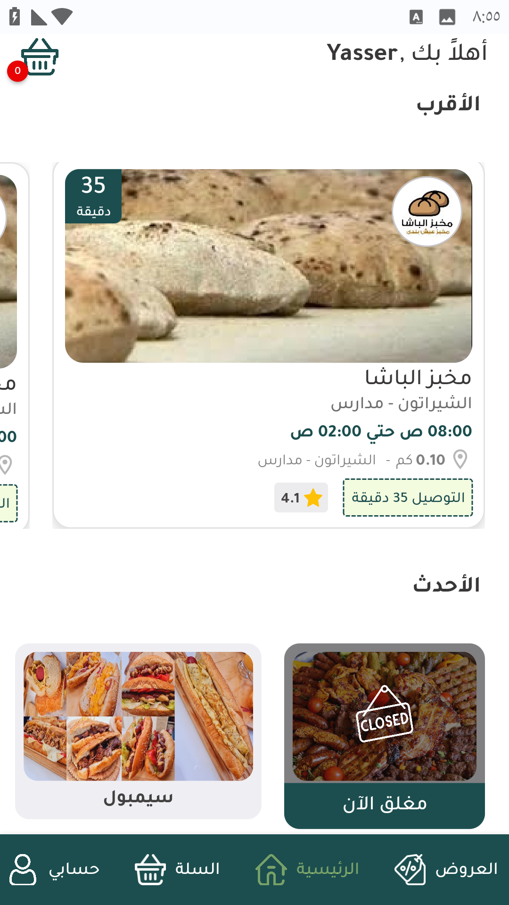

# 📲 Home Page - الصفحة الرئيسية

بعد تسجيل العنوان و الملف الشخصي و عند فتح التطبيق تظهر الشاشة الرئيسية للتطبيق و تختلف علي حسب المحافظة في أسيوط تظهر المتاجر الخاصة بأسيوط و نفس الشئ في الغردقة

<figure><figcaption>
أسيوط
</figcaption></figure> <figure><figcaption>
الغردقة
</figcaption></figure>

<figure><figcaption>
الجزء الثاني من الشاشةالرئيسية
</figcaption></figure>

<h2 align="center">اقسام الشاشة الرئيسية</h2>

<h3 align="right">شريط الترحيب</h3>

<figure><figcaption>
شريط الترحيب
</figcaption></figure>

شريط الترحيب هو الجزء العلوي من الشاشة و يحتوي علي جزئين هما رسالة الترحيب بالعميل و هو علي يمين الشاشة و الجزء الثاني هو سلة المشتريات و هو علي يسار الشاشة

يظهر إشعار أحمر علي سلة المشتريات يحتوي علي عدد المشتريات الموجودة بالسلة

<h3 align="right">شريط العنوان</h3>

<figure><figcaption>
شريط العنوان
</figcaption></figure>

شريط العنوان يظهر فيه العنوان الذي سيتم التوصيل عليه

يمكن تغيير العنوان أو إضافة عنوان جديد عند الضغط علي السهم الظاهر علي يسار الشاشة فتظهر قائمة العناوين المسجلة و خيار إضافة عنوان جديد

<figure><figcaption>
قائمة العناوين
</figcaption></figure>

<h3 align="right">شريط البحث</h3>

<figure><figcaption>
شريط البحث
</figcaption></figure>

يمكن البحث عن متجر أو صنف

<h3 align="right">شريط عروض البانر</h3>

<figure><figcaption>
عروض البانر
</figcaption></figure>

و فيه يظهر عروض التجار المتاحة أو أكواد الخصم



<strong>كل عروض البانر تكون بإشتراك شهري للتجار</strong>



<h3 align="right">أقسام المتاجر</h3>

<figure><figcaption>
أقسام المتاجر
</figcaption></figure>

و فيه تصنيف المتاجر بناءًا علي الأقسام مطاعم ، خضروات ، مخبوزات .....إلخ

<h3 align="right">الأقرب</h3>

<figure><figcaption>
الأقرب
</figcaption></figure>

و فيه مجموعة من المتاجر القريبة من موقع العميل

<h3 align="right">الأحدث</h3>

<figure><figcaption>
الأحدث
</figcaption></figure>

قسم الأحدث يعرض أحدث المطاعم المتعاونة مع التطبيق

<h3 align="right">Footer - أسفل الصفحة</h3>

<figure><figcaption>
Footer
</figcaption></figure>

يحتوي علي تبويبات التطبيق و أقسامه العروض - الرئيسية - السلة - حسابي

