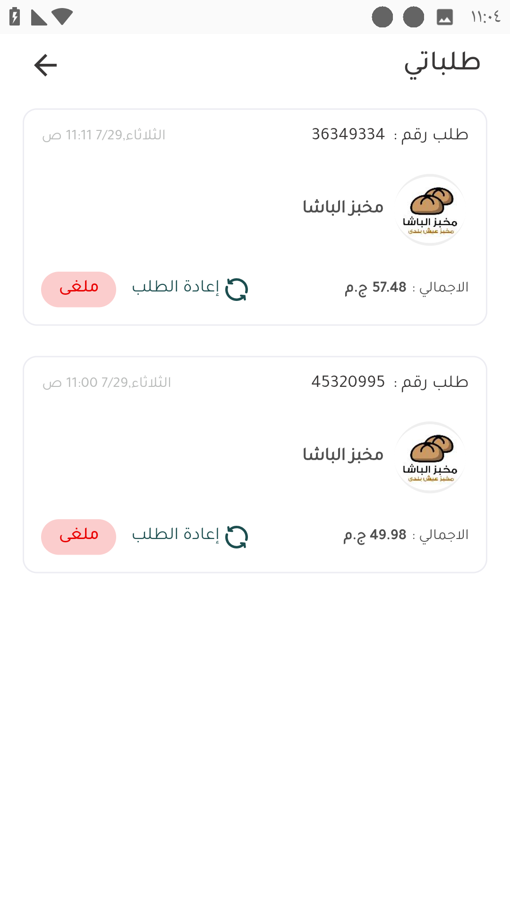

# 📲 إعادة طلب سابق

لو العميل محتاج يعيد طلب كان عامله قبل كدة يقدر يعمل إعادة طلب من خلال حسابي - طلباتي

يروح علي الطلب و يضغط إعادة الطلب

<figure><figcaption>
إعادة الطلب
</figcaption></figure>

بعد الضغط علي إعادة الطلب بتم توجيه العميل لسلة التسوق و فيها الأصناف اللي كانت في الطلب و يقدر العميل يعدل علي السلة براحته سواء يضيف أو يلغي أصناف أو كميات و بعدين يكمل خطوات عمل الطلب <a data-mention href="aml-tlb.md">aml-tlb.md</a>

