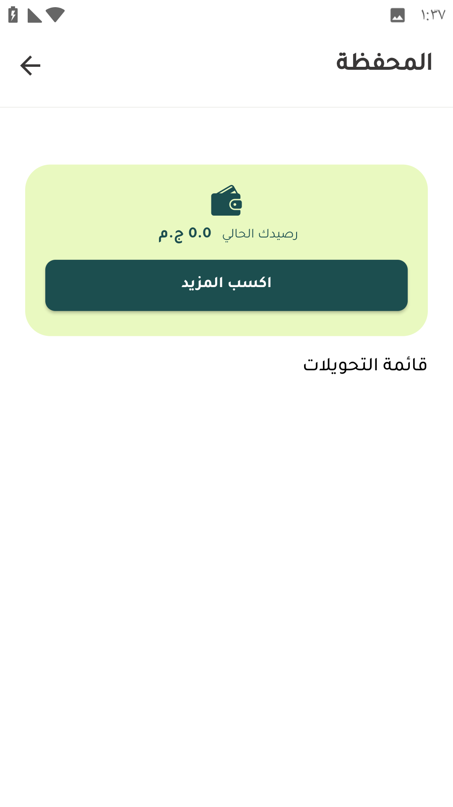
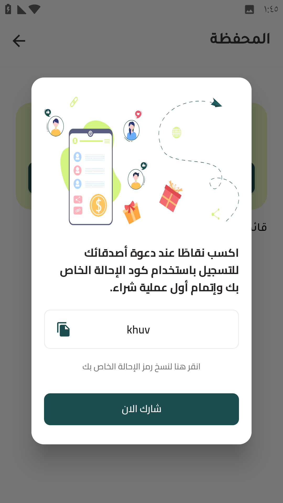

# المحفظة

<figure><figcaption>
المحفظة
</figcaption></figure>

يظهر فيها رصيد العميل الموجود علي المحفظة 

<h3 align="right">دعوة الأصدقاء و كسب النقاط</h3>

عند الضغط علي اكسب المزيد يمكن للعميل عمل دعوة لأصدقاءه و كسب رصيد علي المحفظة بعد تسجيلهم و إتمامهم لأول طلب

<figure><figcaption></figcaption></figure>
