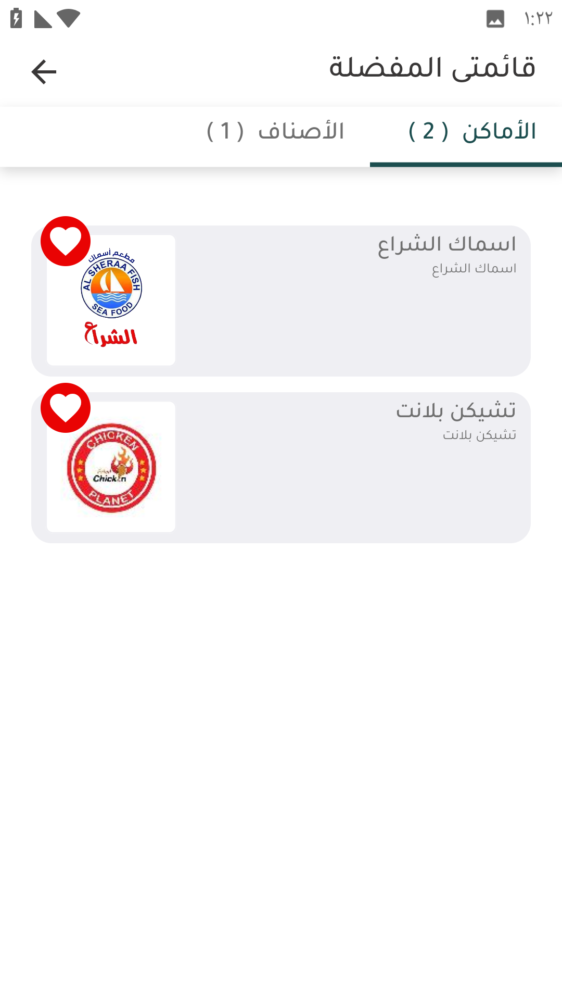
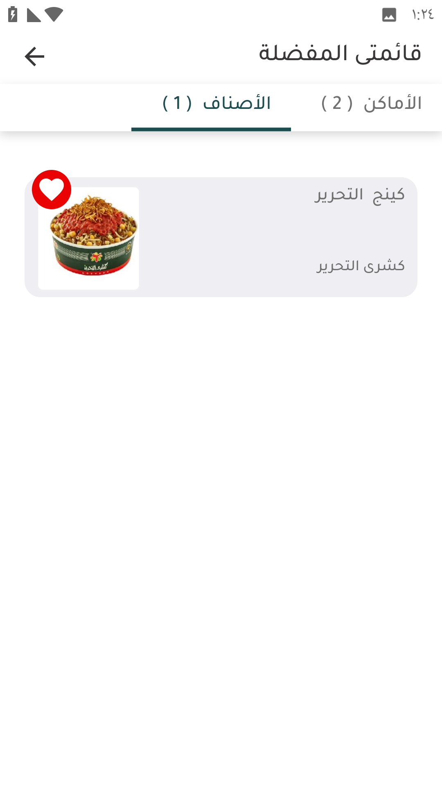
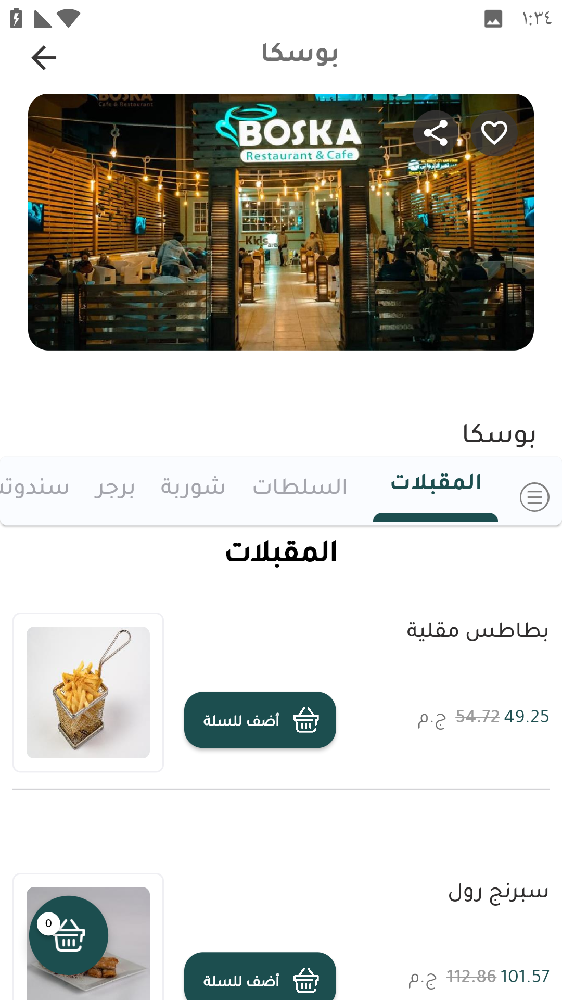
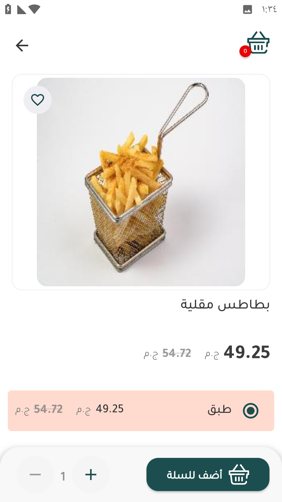

# قائمتي المفضلة

و يظهر فيفيها مفضلات العميل مقسمة إلي أماكن و أصناف كما توضح الصور

<figure><figcaption>
الأماكن المفضلة
</figcaption></figure> <figure><figcaption>
الأصناف المفضلة
</figcaption></figure>

عند الضغط علي احد الأماكن المفضلة يتم توجيه العميل للمنيو الخاص بالمكان

عند الضغط علي احد الأصناف المفضلة يتم توجيه العميل للصنف

<h3 align="right">الإضافة للقائمة المفضلة</h3>

لإضافة صنف أو متجر لقائمة المفضلة يتم الضغط علي أيقونة القلب المتواجدة علي أعلي يمين الصورة الخاصة بالتاجر أو  أعلي يسار صورة الصنف

<figure><figcaption>
تاجر
</figcaption></figure> <figure><figcaption>
صنف
</figcaption></figure>

