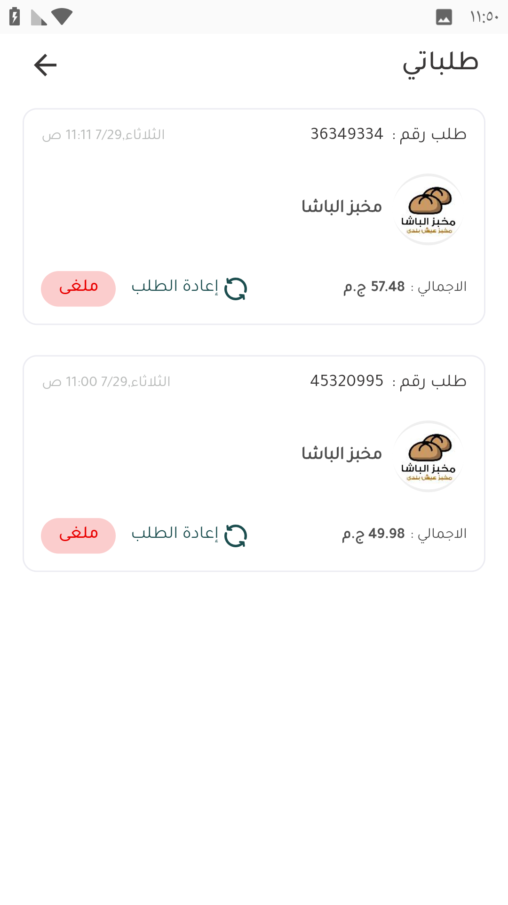

# طلباتي

يظهر فيها كل الطلبات اللي العميل عملها سواء مكتملة أو ملغية

<figure><figcaption>
طلباتي
</figcaption></figure>

من شاشة طلباتي ممكن نعمل إعادة الطلب لطلب قديم <a data-mention href="../iaadh-tlb-sabq.md">iaadh-tlb-sabq.md</a>

