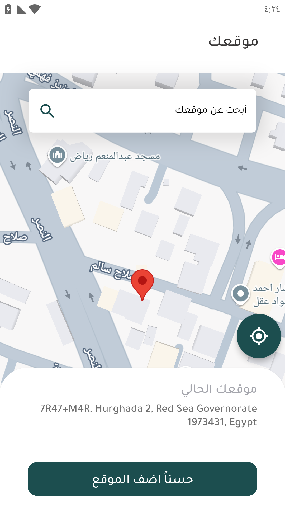
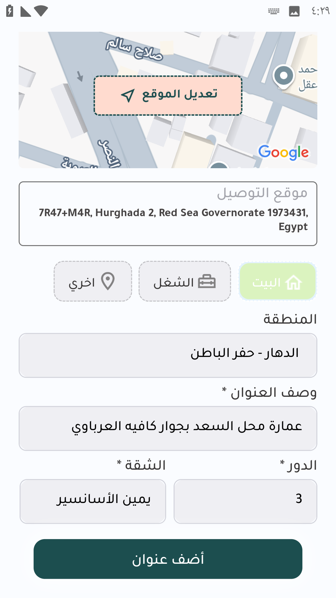

# 📲 تسجيل حساب و إضافة عنوان

التطبيق متاح في متاجر التطبيقات للأندرويد و الأبل و يكون في المتجر مثل الصورة 

<figure><figcaption></figcaption></figure>

بعد تحميل التطبيق تظهر إيقونة التطبيق علي شاشة الهاتف

<figure><figcaption></figcaption></figure>

عند الضغط عليها لأول مرة تظهر شاشة التطبيق الترحيبية

<figure><figcaption></figcaption></figure>

<figure><figcaption></figcaption></figure>

عند التخطي تظهر شاشة تسجيل الحساب أو تسجيل الدخول

<figure><figcaption></figcaption></figure>

في حالة وجود حساب يتم تسجيل الدخول عن طريق كتابة رقم التليفون و كلمة السر و الضغط علي تسجيل دخول

في حالة التسجيل لأول مرة يتم الضغط علي حساب جديد و اتباع الخطوات لتسجيل حساب جديد

كتابة الاسم

رقم الهاتف

اختيار كلمة مرور

اختيار تاريخ الميلاد

اختيار النوع

الموافقة علي الشروط و الأحكام

<figure><figcaption></figcaption></figure>

في حالة تم الدعوة من صديق يتم اختيار هل تمت دعوتك بواسطة صديق و إدخال كود الدعوة 

<figure><figcaption></figcaption></figure>

بعد تسجيل البيانات يتم ارسال كود تأكيد إلي رقم الهاتف المسجل و يتم إدخال الكود الفيديو يوضح خطوات التسجيل


خطوات تسجيل حساب جديد


بعد إتمام خطوات التسجيل يقوم التطبيق بإعادة المستخدم للصفحة الرئيسية لتسجيل الدخول

 يتم تسجيل الدخول عن طريق كتابة رقم التليفون و كلمة السر و الضغط علي تسجيل دخول

<figure><figcaption></figcaption></figure>

بعد تسجيل الدخول يطلب التطبيق الدخول للموقع الجغرافي للجهاز لتحديد العنوان و عرض المتاجر الخاصة بمدينة العميل

<figure><figcaption></figcaption></figure>

بعد السماح بإستخدام الموقع يمكن تحديد العنوان عن طريق وضع العلامة في العنوان الصحيح للدقة

<figure><figcaption></figcaption></figure>

بعد الضغط علي حسنا أضف الموقع يتم تحويل العميل لصفحة إضافة تفاصيل العنوان الدور و الشقة و اسم الشارع و العلامة المميزة إذا وجدت ثم الضغط علي أضف عنوان

<figure><figcaption></figcaption></figure>

عند فتح التطبيق و في حالة إختلاف العنوان المسجل عن موقع العميل الحالي يظهر للعميل إشعار لتعديل العنوان

<figure><figcaption></figcaption></figure>
