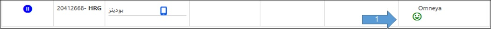
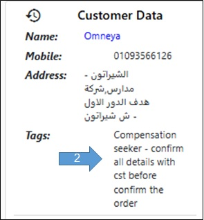

# Tags - الوسم

التاج ده بيكون وصف مننا للعميل عشان أي حد يشوف الطلب بتاعه يقرأ الوسم و يتصرف بناءًا عليه.
 التاج هيعرفنا لو العميل ده مهم او دايما بيشتكي ... إلخ.
 1- في حالة وجود تاج بتظهر علامة الإيموجي في خانة اسم العميل.
 2- لقراءة التاج بالكامل بندخل علي شاشة تفاصيل الطلب و الوسم بيظهر في جزء معلومات العميل.

<figure><figcaption></figcaption></figure> <figure><figcaption></figcaption></figure>

<h4 align="right">طيب لما أشوف عميل عليه تاج أعمل ايه؟</h4>

أول حاجة لازم تقرأ التاج كويس جدا و لو في أي تعليمات موجودة تبلغها للشخص المعني سواء المندوب أو المتجر عشان يخلي باله أو يعمل الإجراء اللازم.
 في المثال ده العميل ده دايما بيطالب بتعويض و لازم اننا نأكد كل تفاصيل الطلب مع العميل قبل تأكيد الطلب.

