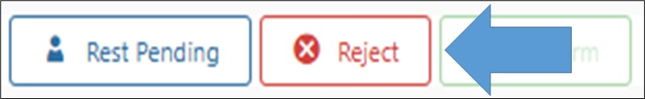

# طلب أكبر من 1000 جنيه



في حالة إن الطلب أكبر من 1000 جنيه مش بيتحرك من مرحلة الpending غير لما يتم تحويله من الموظف في حالة انه كاش.





بس لو الدفع اونلاين بمجرد تأكيد الدفع بيتحول تلقائيا.



<h3 align="right">طيب ايه المطلوب مني لما ألاقي طلب كبير كاش؟</h3>

Rest pending أول حاجة نبص علي هيستوري العميل لو متعود يطلب طلبات كبيرة يبقي مش هنعمل حاجة و ننقل الطلب .
 لو مفيش طلبات كبيرة قبل كدة بنرجع نتصل بالعميل و نأكد معاه الطلب و السعر.
 لو العميل أكد معانا الطلب بنحوله من علي السيستم.
 لو كان مطلوب بالخطأ يبقي نلغي الطلب من علي السيستم.

<h3 align="right">إزاي أجيب هيستوري العميل علي السيستم؟</h3>

ندخل علي شاشة تفاصيل الطلب.
 و نضغط علي علامة الهيستوري شبه الساعة صورة 1.
 هيظهرلنا اخر 5 طلبات للعميل صورة 2.

<figure><figcaption></figcaption></figure> <figure><figcaption></figcaption></figure>

<h3 align="right">إزاي احول الطلب بعد التأكيد؟</h3>

بسيطة بنضغط علي Rest Pending من شاشة تفاصيل الطلب بعد الخطوات اللي فاتت صورة 3.

<figure><figcaption></figcaption></figure>

<h3 align="right">إزاي ألغي الطلب؟</h3>

بسيطة بنضغط علي Reject و نختار سبب إلغاء الطلب

<figure><figcaption></figcaption></figure>

<figure><figcaption></figcaption></figure>

<h3 align="right">أيه هي اسباب الإلغاء؟</h3>



يتم إرسال رسالة نصية للعميل في حالة إلغاء الطلب تحتوي علي سبب الإلغاء

يتم إختيار سبب الإلغاء الأساسي




<h4 align="center">لا يتم إختيار سبب بناءا علي رغبة سيادتكم إلا في حالة طلب العميل إلغاء الطلب بدون سبب</h4>


<table><thead><tr><th width="361.9090576171875" align="center">Arabic</th><th width="376.0909423828125" align="center">English</th></tr></thead><tbody><tr><td align="center">وقت اعداد الطلب لا يناسب سيادتكم</td><td align="center">Cooking time is too long</td></tr><tr><td align="center">مشكله في الشبكه</td><td align="center">Network Issue</td></tr><tr><td align="center">لم يتم القبول من جانب المتجر ( Multi Orders )</td><td align="center">Not Accepted via vendor ( Multi Orders )</td></tr><tr><td align="center">لم يتم القبول من جانب المتجر</td><td align="center">Not Accepted via vendor</td></tr><tr><td align="center">لعدم رد سيادتكم علي مكالمه تأكيد الطلب</td><td align="center">Cst isn`t responding for 1st confirmation call</td></tr><tr><td align="center">لعدم رد سيادتكم علي مكالمه تأكيد الطلب</td><td align="center">Cst isn`t responding for confirmation call</td></tr><tr><td align="center">لعدم توافر تفاصيل ملحوظات الطلب</td><td align="center">Unavailable customer request</td></tr><tr><td align="center">لعدم اكتمال عملية الدفع</td><td align="center">Online Payment Canceled</td></tr><tr><td align="center">لأن المتجر المطلوب مغلق الان</td><td align="center">Merchant is Closed</td></tr><tr><td align="center">عدم اتاحه كميات الطلب ( Multi Orders )</td><td align="center">Unavailable Items Quantity ( Multi Orders )</td></tr><tr><td align="center">عدم اتاحه كميات الطلب</td><td align="center">Unavailable Items Quantity</td></tr><tr><td align="center">عدم اتاحه اصناف الطلب</td><td align="center">Unavailable Items</td></tr><tr><td align="center">عدم اتاحه اصناف الطلب</td><td align="center">Unavailable Items ( Multi Order )</td></tr><tr><td align="center">ضغط الطلبات في الوقت الحالي</td><td align="center">Rush Hour</td></tr><tr><td align="center">تيست اوردر</td><td align="center">Test Order</td></tr><tr><td align="center">بناءا علي رغبة سيادتكم</td><td align="center">Due to Customer Request</td></tr><tr><td align="center">اوردر متكرر</td><td align="center">Duplicated Order</td></tr><tr><td align="center">المطعم غير جاهز لاستقبال الطلبات</td><td align="center">Merchant is not ready</td></tr><tr><td align="center">الطقس غير مناسب للتوصيل</td><td align="center">Bad Weather</td></tr></tbody></table>

<h4 align="center">Cst isn`t responding for 1st confirmation call</h4>

العميل لم يرد علي مكالمة الطلب الأول (متعلقة بأول طلب للعملاء فقط)

<h4 align="center">Cst isn`t responding for confirmation call</h4>

العميل لم يرد عل مكالمة تأكيد أي طلب بعد أول طلب

<h4 align="center">( Multi Orders )</h4>

الأسباب المحتوية علي هذه العبارة متعلقة بالطلبات المجمعة

