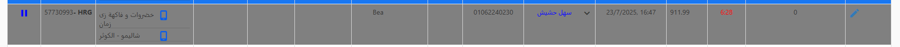

# ⏳ طلب فيوتشر

<h3 align="right">ايه هو الطلب الفيوتشر؟</h3>

الطلب الفيوتشر هو طلب العميل طلبه و لكن محدد وقت يوصله فيه كمثال العميل طلب الصبح طلب و حابب يوصله المغرب

<h3 align="right">ايه هو الفرق بين الطلب الفيوتشر و الطلب العادي علي الأدمن؟</h3>

أول فرق إن الطلب بيظهر علي الأدمن بيكون لونه رمادي

<figure><figcaption></figcaption></figure>

تاني فرق في شاشة تفاصيل الطلب بيكون ظاهر تفاصيل الطلب

وقت و تاريخ الطلب Order Date

وقت بدأ التجهيز Start Prepartion

الوقت المطلوب فيه الطلب Expected Delivery Date

موعد استلام المندوب للطلب Expected PickUp Date

<figure><figcaption></figcaption></figure>



<strong>Cooking time &#x26; delivery time يتم تحديد وقت التجهيز وقت التوصيل تلقائيا من النظام</strong> 


